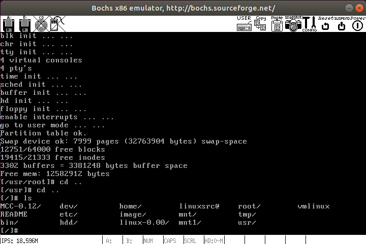

# LinuxKernel-src0.12
build linuxkernel0.12 on ubuntu 18.04 &amp; run linuxkernel0.12 on boch2.6

## Note
As I study linux-kernel0.12 by following a pdf, so I want to run and debug it in my ubuntu1804 by using bochs. 

I do some funny things based on the original codes.

## How to build it
### Deps
We should install make,gcc,gcc-multilib,bin86 firstly.
- sudo apt install build-essential cmake make gcc-multilib g++-multilib module-assistant bin86

### Let's do it
Build kernel image.  
the 'myfloppy.img' can loaded by bochs.  
The rootfs-dev is 0x301. 
The swap-dev is 0x304.
- make disk

Clean last build
- make clean

## Result
